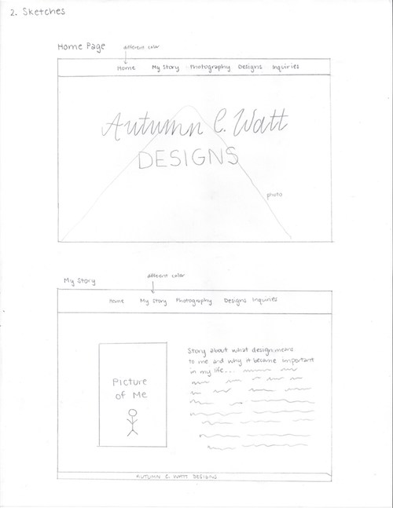
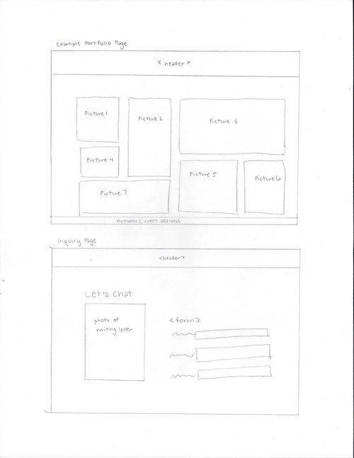

# Project 1, Milestone 1 - Design & Plan

Your Name: **Autumn C. Watt, acw227**

## 1. Persona

[1. Pick a persona]

I've selected **Abby** as my persona.

I've selected my persona because... **I want my website to be minimalistic and easily intuitive, so I'd like to appeal to someone who has low confidence in computing. Additionally, I believe my portfolios will nicely complement a comprehensive learning style because they would explore a lot that the website has to offer and then come back to their favorites rather than trying to follow a flow.**

## 2. Sketches

[2. Create some sketches to generate ideas about a website design that would work for your persona.]

**I believe my sketches fit the needs of the user because it's a very simple and intuitive design. The header appears on each page which allows easy access to elements. The title of each page is informative and explains the content that can be found on it.**

## 3. Wireframes

[3. Author detailed wireframes that will become the design that you program for the final milestone.]

## 4. Coding Plan & Pseudocode

[4. Author a plan for how you will code your PHP website.]

*[a. Make sure you layout how to you plan to use PHP *includes*.]*

**HEADER.php**
-----------------------

add logo in the middle

for each file name (key) and page name (value)
    create a LI tag so that the user can click on the tag and be directed to that page

    if (current page == page name)
        change the color of the page name in the header

    end if

end for each

**FOOTER.php**
-----------------------
text "Autumn C. Watt Designs // 2018"

*[b. Write your pseudocode for your user defined function.]*

**USER-DEFINED FUNCTION**
-----------------------
**function will layout images on a page gallery style**

create an array for all the images to go on that page
create a grid with buffer for inbetween images
decide how many columns, rows can go on indefinitely

//if needed, will make all squares. Would like to figure out without having to make all images squares

if (width != size of image), return error

    for each (images in $images)

        get index to see which column and row image should be in
        draw image at that spot in the grid

    end for each

*[c. Write pseudocode for pages.]*

**HOMEPAGE**
-----------------------
inset background image that spans the width of the browser
add text "Autumn C. Watt Designs" as title

**MY STORY**
-----------------------
insert image of me that spans between a border and half the width of the browser

add text paragraph that spans between half the width of the browser to a border, on opposite side of image, explaining the story about what design means to me and why it became important in my life

**PHOTOGRAPHY / DESIGNS**
-----------------------
use user-defined function to draw images on page

**INQUIRIES**
-----------------------
add title to page "Let's Chat"
insert related image that spans between a border and half the width of the browser

add form that spans between half the width of the browser to a border -- opposite side of image

  **Typed**
  asks for Name, email address, and requested project
  **Dropdown**
  (tentative) type of design project requested
  **Output** text appears beneath form saying "Thank you $name for your request. We will be in touch shortly."
